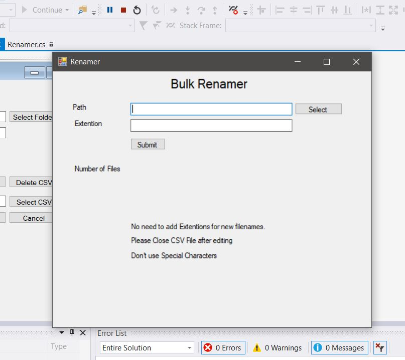
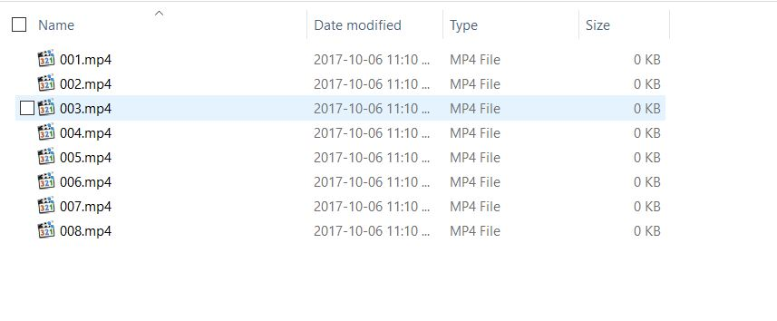
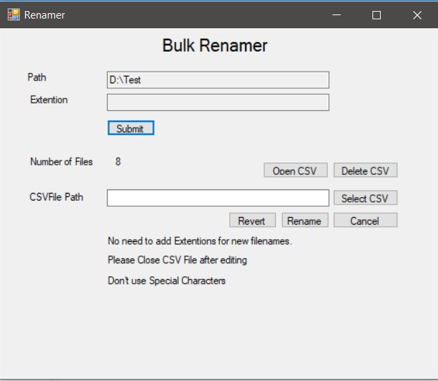
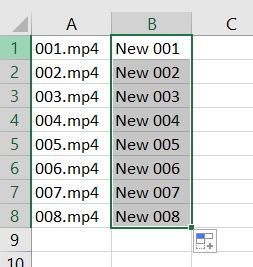
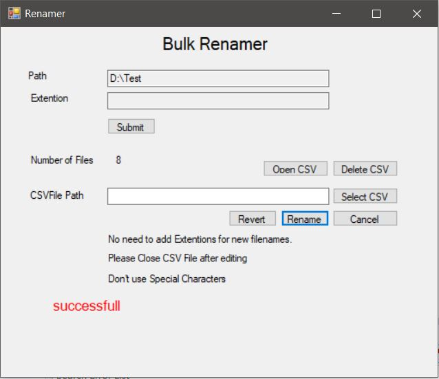
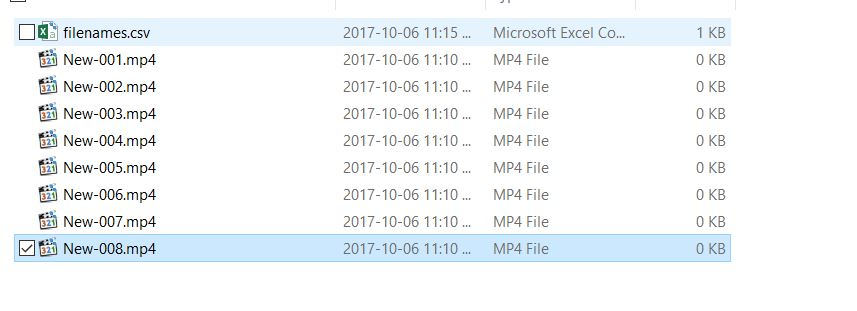
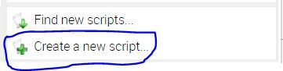
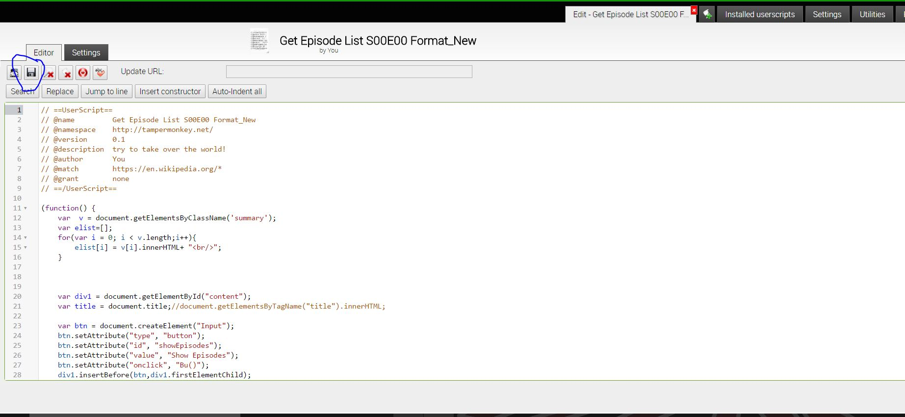
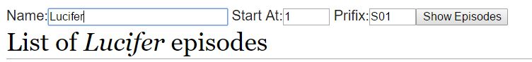
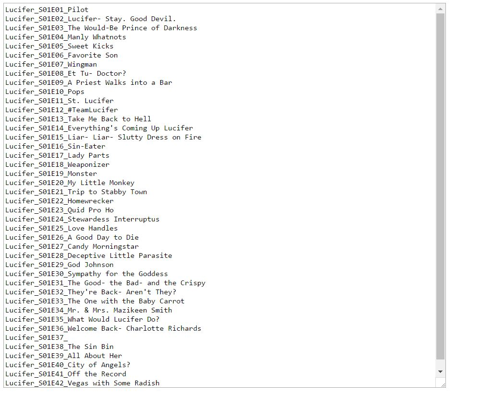

# Rename-Episodes-from-Wikipedia-List-of-Episodes

This Project will help you to rename your files (default is .mp4 but works with any extensions and any file types)

  

**Example Files before renaming**

## How to Use Rename Windows App

1. Run Renamer Windows App using Visual Studio.

2. Select the path of the folder containing your files that are to be renamed.
3. Specify the extension (**No need to specify if the files are in ".mp4" format**).
4. Press Submit. Here you will get number of files with the extension in that folder.  

5. * Press Open CSV. Just paste or type the new names(**Don't use commas or any special characters in the name.**) just next to the first column (**No need to specify Extension**). 
   * If you have your own CSV file select it.  
   
   

6. Close the CSV file(**If you don't close it app will not be able to access it**)
7. Press Rename button. If the rename is successful you will get success message at bottom or else you will get error and a log file will be generated in the folder to help you find the error.

  

**Example Files after renaming**

## How to get Episode names from Wikipedia
You need TamperMonkey or Greasemonkey for this to work. I'm using TamperMonkey in this.
1. Open javascript file "Get Episode List S00E00" in "Get Episode List from Wikipedia for Tampermonkey" folder and copy it.
2. Create a new script in TamperMonkey and paste everything from "Get Episode List S00E00" javascript into this.  

  

**Paste JavaScript in Editor and Save it**

  

3. Open any Wikipedia page with list of episodes. Eg: https://en.wikipedia.org/wiki/List_of_Lucifer_episodes  

**Edit Name, Start At, Prifix fields to get the episode prifix you need**

  

4. You will see text boxes with (Name, Start At, Prifix) lables. 
  * Name: Give The name you want to add before the name of each episode. 
  * Start At: It is by default "1". You can use it to select the startpoint of numbering. If you put 2, numbering starts from 2nd name in the list i.e. Second name with get 01 numbering.
  * Prifix: It is the prixif for Each Episode. By default it is "S01" to specify Season 1. You can change it to anything you are comfortable with.
5. Press "Show Episodes" button once you set all the settings. It will open a new tab with all the names in the page. You just have to copy the names you needed.

  

**You can use these names with Renamer Windows app and Rename you files with episode file names**
